# 23.04 Start of Linear commissionning (Day 1)

- didn't start off with virgin optics, reusing corrections from beam test
- 2021 beam test optics verified

[plot of beta beat at injection]
[plot of disperions at injection]

## Shift Summary

### Done during shift
Optics at injection, ADT AC-Dipole, Kmod, DOROS, Chromaticity.
In more details:

- Measured the injection optics with the corrections calculated during the 2021 beam test and compared it to the nominal. It looks very similar to what we observed at that time, no corrections were re-calculated.

- The ADT AC-dipole had some issues with the settings but this was fixed together with Martin and we could then excite. The coupling correction is a bit low compared to the correct value but it converged nicely.

- K-modulation was attempted for IP1 and IP5, which worked fine. Some small issues remain in the interface between the acquisition and the analysis however. 
- Spent some time doing kicks for the BI people to look at the DOROS BPMs.
- Some kicks for many turns AC-Dipole.
- Measurements with to have a look at the chromaticity. The Q''' is significantly different than it was measured during the 2021 beam test.

### Results:

A folder with results for the day has been created at `/afs/cern.ch/eng/sl/lintrack/LHC_commissioning2022/COM_2022_04_23_injection_validation`.
One can find there a folder with plots (and commands to reproduce them), another one with detected bad BPMs from SVD and IF cleaning, and Beam[12] symlinks to the location of analyses done for the day. See screenshot attached below.

**Follow up**: Calculation of chromaticity correction for tomorrow's shift.

**Problems**: Nothing important to report, at some point we lost the concentrator but this was later fixed

# 24.04 (Day 2)
## Shift Summary

### Done during the shift:

- Started with Q''' measurements to determine new Q''' corrections.

- The new MCS compensation scheme by Tobias was successfully tested for both beams. 

- The Q''' and Q'' corrections were implemented and and validated in chromaticity scans. 

- Amplitude detuning measurements were taken to validate the baseline with the new corrections in. Horizontal, vertical and diagonal kicks were performed. Small amplitude detuning is observed, but more thorough analysis will be needed to provide final values. 

- Decapolar resonance driving terms were measured for the first time at injection energy in the horizontal plane, namely H(0,±4) and H(±1,±3). A shift in Qy, was used to validate both the shift in frequency of the resonance line as well as the reduction of amplitude when moving away from the resonance.

- Removing the new Q''' correction results in the disappearance of the decapolar lines. This suggests a nonlocal correction of decapolar terms.

### Needed Follow-up:

- More thorough analysis of amplitude detuning.
- More in depth analysis will follow of the Q''' correction's impact on the decapolar lines.

# 25.04 Coupling in the ramp (Day 3)

-    We did the manual coupling measurement during the ramp because the coupling server failed to give good results (probably because of the S problem but this needs to be checked)
-    we calculated coupling corrections (verifying on the way that the selected model didn't deteriorate the calculations)
-    these were programmed in to be applied during the next ramp
-    re-measure showed that we corrected < 0.005 at every pick-up point
-    we are happy with this result

## Shift Summary

### Done during the shift:

- Analysis of kicks taken during the ramp to find out the coupling corrections. These were then trimmed in for subsequent ramps, which went better.
- Successfully got measurements at flat-top! First analysis of the machine at flat-top shows expected range of values for linear optics. 
- Had a look at local errors, tried trimming in the corrections Tobias had calculated for 2018 to see what segment-by-segment yields, and it seems the local errors are quite different this time around (corrections are too weak in IP1, too strong in IP5). Local errors seem similar to those found in 2012.

A folder in lintrack has been created that holds symlinks and plots.
It is at `/afs/cern.ch/eng/sl/lintrack/LHC_commissioning2022/COM_2022_04_25_flattop_optics/`

### Needed Follow-up:

- Double check of the 2018 corrections calculated by Tobias.
- More in depth look at the local errors, may be worth it to try and find corrections so we can compare to the 2018 ones.

### IMPORTANT:

The models used today did not include MQTs extraction!
Felix S came back the next day to remake the analyses with correct models, helps quite a lot with the error bars. See the 2022-04-26 logbook page (tomorrow) for more information.
Attached are results analyzed that day.

Important too, the symlinks in `/afs/cern.ch/eng/sl/lintrack/LHC_commissioning2022/COM_2022_04_25_flattop_optics/` point to Results folders created on 2022-04-26 (but today is 2022-04-25) for the reason mentionned above. It is normal. There is a README there to explain this.

# 26.04. (Day 4)

## Shift Summary

### Done during the shift:

- Creation of models for yesterday's flattop measurements with correct error definitions (using fixed Beta-Beat.src) and MQTs extraction.

- Felix S did a re-analysis of yesterday's flattop measurements for B1 and B2 with correct models. 

- We took some time to cross-check the 2018 corrections that were calculated by Tobias. All seemed fine.

- Felix C (doctor Felix) and Jacqueline had a look at the local errors and tried to find some first step for phase corrections. Values are compared to the 2018 ones.

- Felix S (student Felix) had a look at local errors and tried to find some first step for coupling correction.

Relevant plots and scripts have been added to lintrack. They are available at /afs/cern.ch/eng/sl/lintrack/LHC_commissioning2022/COM_2022_04_25_flattop_optics/plots/flattop

# 27.04. (Day 5)

## Plan for the day

-    Measurements at 60cm for corrections
-    Measurements at 30cm for corrections

## Shift Summary
### Done during the shift:

- First measurements at squeezed optics have been performed. Measurements at 60 cm were done, with beta-beating to about 60%.
- Further measurements were done at 30cm. Initial analysis showed large beta-beating in the arc on the order of 150%. K-modulation measurements confirmed this large deviation of the optics and waist.
- Both turn-by-turn data and k-modulation data were used to calculate local IP5 corrections. Trimming in the corrections resulting in a very significant reduction of overall beta-beating to around 20% beta-beating in B1 (Beating measurement with Coupling of 0.03 gave initially a beating of 40%, so coupling can double beta-beating, see plot) and 30% in Beam 2.
- Further analysis produced possible IP1 correction candidates, that will be tested at a later stage.

Relevant plots and scripts have been added to lintrack. They are available at 

/afs/cern.ch/eng/sl/lintrack/LHC_commissioning2022/COM_2022_04_27_at30cm/plots

**Important** - An issue was found and resolved for the automatic matcher, where the MAD-X run would try to access memory out of range and crash. See this entry for an explanation and the solution: https://logbook.cern.ch/elogbook-server/GET/showEventInLogbook/3543202

- An important "bug" was found in the optics files that affects Segment-by-Segment since right side correctors are linked (deferred expression) to left side ones. See this entry for an explanation and the solution: https://logbook.cern.ch/elogbook-server/GET/showEventInLogbook/3543202

# 28.04 (Day 6)

## Plan for the day:
-    Ramp-up of ballistic optics
-    Measurements of ballistic optics at flattop

## Shift Summary

### Done during the shift:

- Measured during the ramp-up of ballistic optics to 6.5TeV. The coupling was enormous during the ramp so we lost half of beam 1 but beam 2 was fine.
- Measured ballistic optics but without degaussed triplet.

[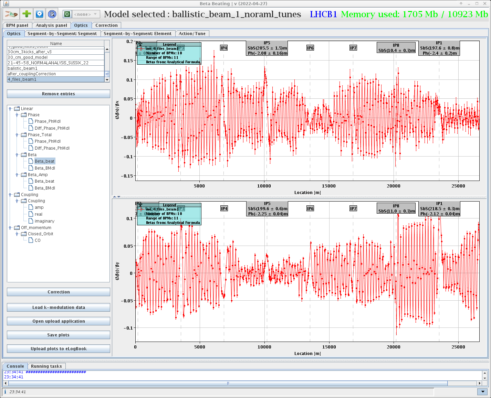](images/day6-1.png)
[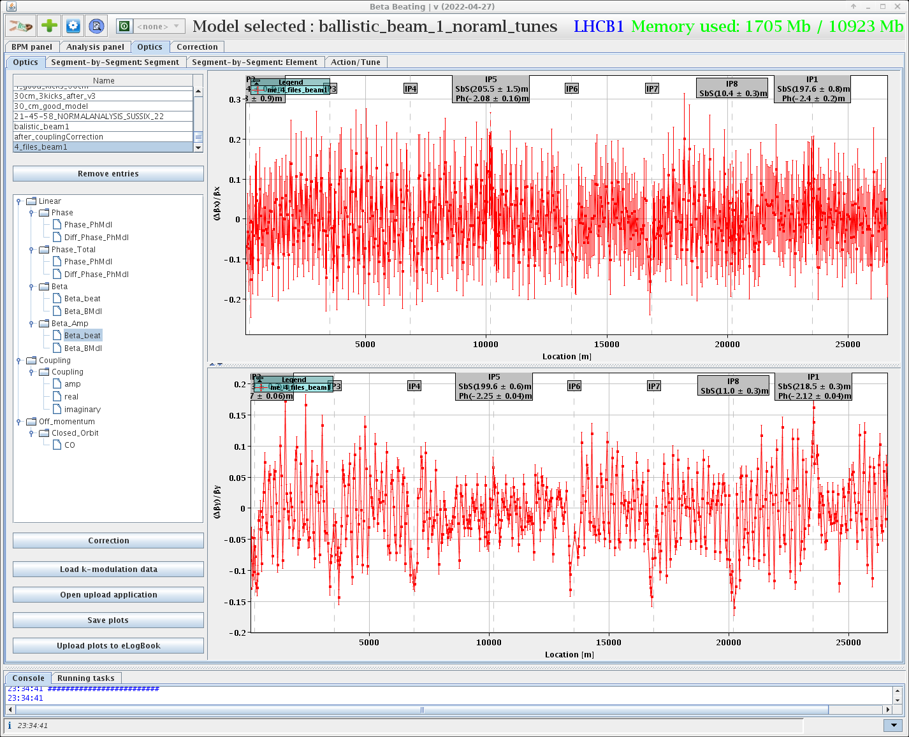](images/day6-2.png)
[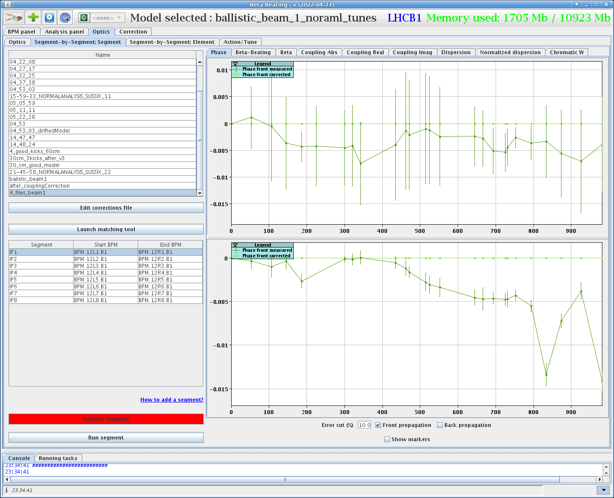](images/day6-3.png)
[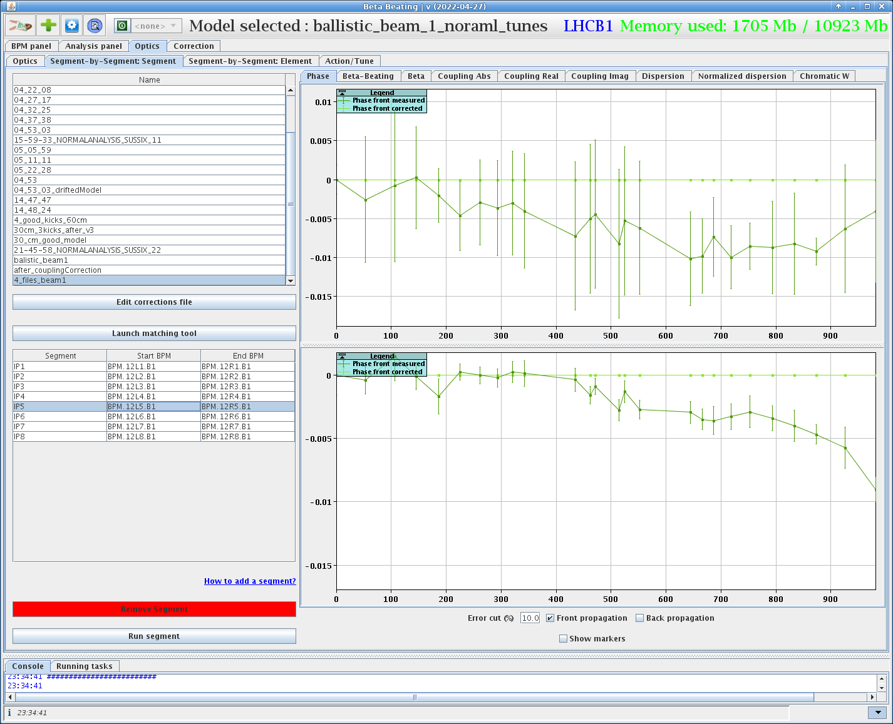](images/day6-4.png)

# 02.05. (Day 7)

## Plan for the day:

- Measurements at 133cm (end of ramp)
- Measurements at 60cm (mid-squeeze)
- Measurements at 30cm (mid-squeeze)

## Shift Summary

### Done during the Shift:

- Measurements and local corrections validations at 133cm -> very good, below 10% beta-beating
- Measurements and local corrections validations at 60cm -> very good, below 10% beta-beating too.
- Measurements and local corrections tests at 30cm, determined trims with Segment-by-Segment and Action Phase Jump. See attached screenshots of 30cm before local corrections vs 30cm with today's corrections trimmed in. IP5 was based on SbS and IP1 was based on APJ for the first time.
- Peak beta-beat around 17% at 30cm after local corrections and the beta-beat at the IP around 8% with small waist shift (~4cm).
- An arc-by-arc correction of the global coupling will be calculated based on this measurement for beam1. The plot also shows why the BBQ can show so different result from the ADT-measurements. 
- Local corrections incorporated in the ramp and squeeze. 

- Did quick qualitative check of IR1/5 b4 correction by trimming off RCOX and looking at BBQ measurement quality. Saw fairly clear deterioration of the BBQ signal for the V plane when the IR-octupole correction was removed (screenshot). Hard to say for horizontal plane. Will need to measure detuning - but as mentioned above this would benefit from prior collimation setup.

Relevant plots and scripts have been added to lintrack. They are available at 

/afs/cern.ch/eng/sl/lintrack/LHC_commissioning2022/COM_2022_05_02_squeeze_local_corrections/plots

**Relevant**:
-Issues when kicking, would potentially benefit from collimation setup for the next studies, both for global corrections and nonlinear ones.

[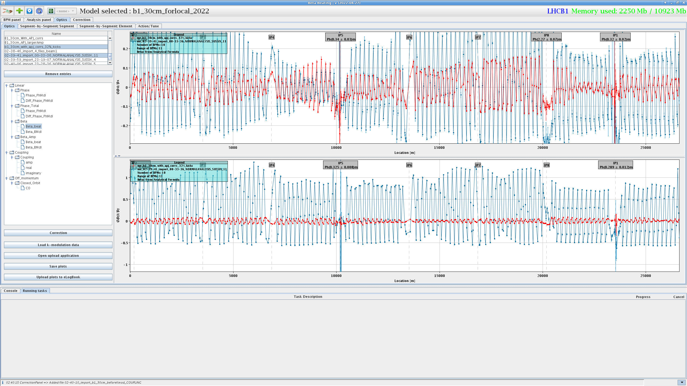](images/day7-lhcb1_30cm_betabeat_before_vs_after_local_corrections.png)
[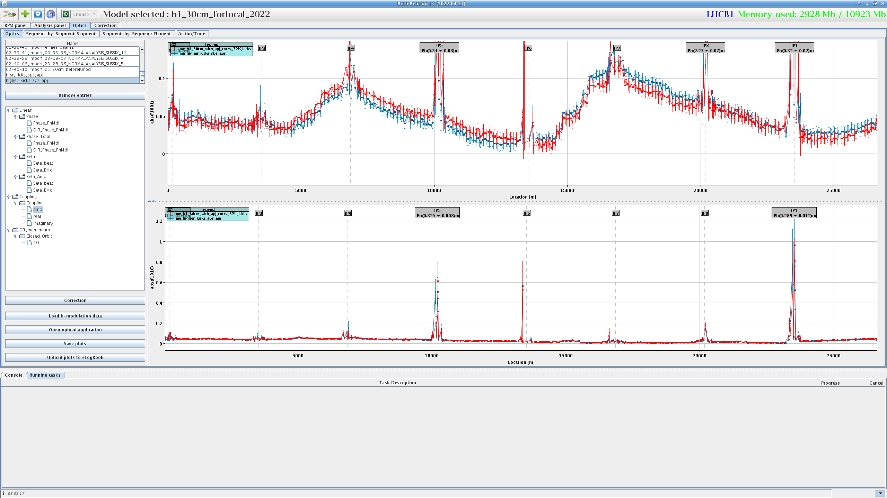](images/day7-lhcb1_coupling_rdts_amp.png)
[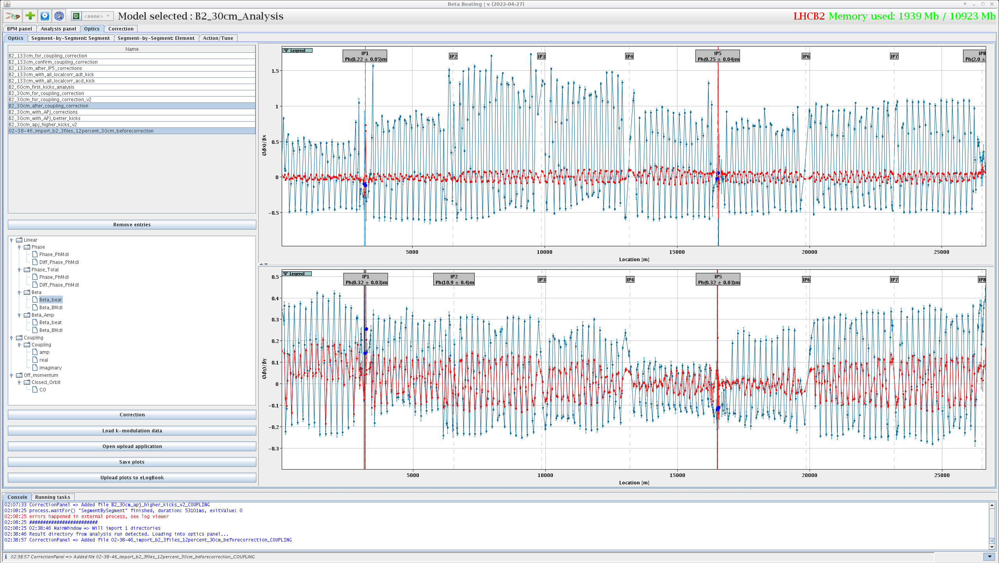](images/day7-lhcb2_30cm_betabeat_before_vs_after_local_corrections(1).png)
[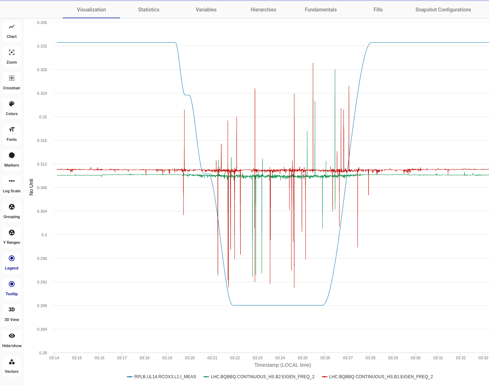](images/day7-screenShot_May_3rd_2022_03_44_00.png)
[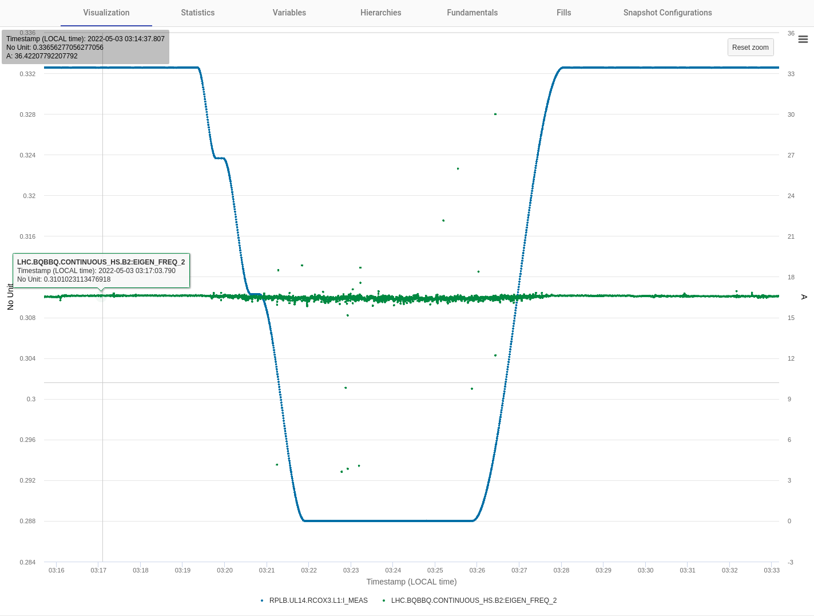](images/day7-screenShot_May_3rd_2022_03_44_13.png)

# 08.05 Ballistic Optics Measurements (Day 8)

## Shift Summary

### Done during the shift:
- Measurements for coupling correction, which was very well corrected (but BBQ was not helpful, said it would be spoiled bu in the end coupling was better).
- On and off-momentum measurements. Normalized dispersion looks good in both beams.
- Many amplitude detuning measurements, done fast as time ran out. Only very little losses seen until 50-60%. Looked at some spectra and nat. tunes were well visible.
- Calibration factors seem to look good, but Mael is lazy and wants to sleep (so French).
- Brownies were amazing!

### Problems:
- Had issues masking ATLAS BCM during the whole shift (until 15min before end), and ATLAS control had to mask every 30 seconds manually. (ALWAYS CHECK BUTTON IN MULTITURN TO BE GREEN!)

## Then continued to

### Squeezing to 60cm

[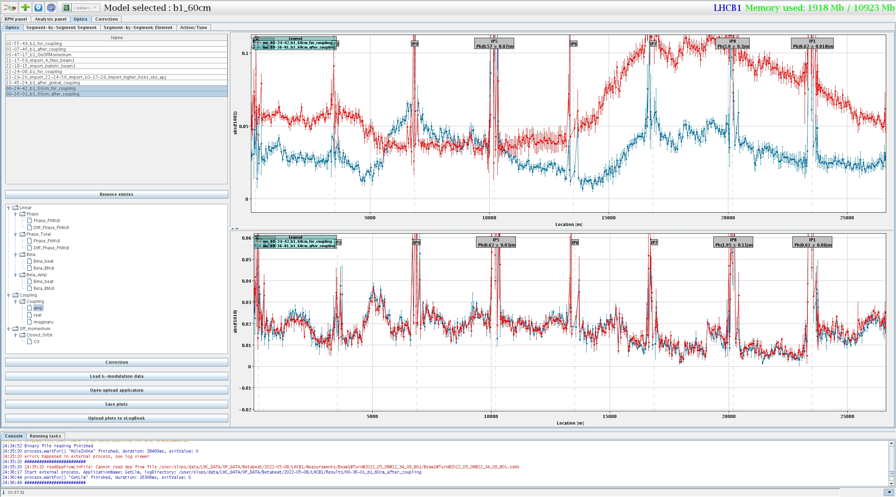](images/day8-b1_60cm_coupling_before_after.png)

### Squeezing to 30cm

[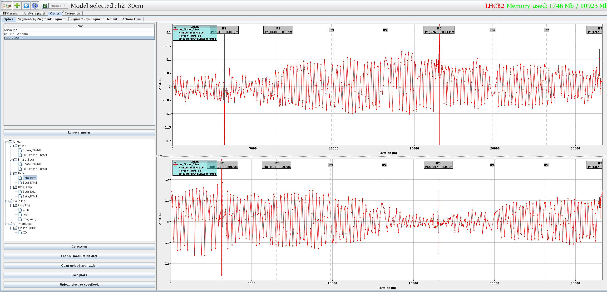](images/day8-beta_beating.png)

### On/OffMom

### AmplDet

### Local Coupling

Looking at more recent measurements to try and determine a local coupling setting for what we saw around IP1.
Quite similar to what I had seen with previous 30cm measurements.

**Settings are**:
kqsx3.l1 = kqsx3.l1;
kqsx3.r1 = kqsx3.r1 + 1e-4;

Going up/down from 1e-4 favors one beam over the other. I'm happy with this setting so we will try to trim it in after kicks are done.

To trim:
- This is a correction value from SbS that matches the observed machine so there's a sign change to be done.
- These are SKEW magnets so there is another sign change to be done.
=> overall we need to trim the value above with the same sign (double sign change), so: 1E-4

### Trimming Crossing Angles In

# 10.05 (Day 10)

## Plan for the shift:
- Some corrections at 30cm
- Felix's Rigid Waist Shift for Local Coupling
- Nonlinear measurements at 30cm

## Shift Summary
### Done during the Shift:
- At 30 cm we measured the calculated correction for flat orbit (see attached plot). Peak beta-beat went from ~19% to 9% with most points well below 5%.
- Did Felix S.'s procedure with the rigid waist shift knob at IP5. Data to be analyzed to find an optimal setting of the colinearity knob.

Relevant plots and scripts have been added to lintrack. They are available at 

/afs/cern.ch/eng/sl/lintrack/LHC_commissioning2022/COM_2022_05_10_30cm_global_corrections_and_rigid_waist_shift/plots

### Issues:
- Some issues injecting in the beginning of the night with two issues: a real time trim on the RF that had to be reset and then erratic kicker. After the advice to make a dry injection everything worked fine.
- Warning when we started the ramp that not all collimators were set but after some guidance it was clear that this was due to that not all collimators are actually moving.
- When trimming out the knobs that we had used for the test, the RQ6.R5 tripped and the beams were dumped.